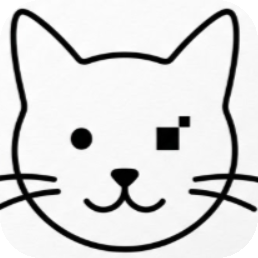
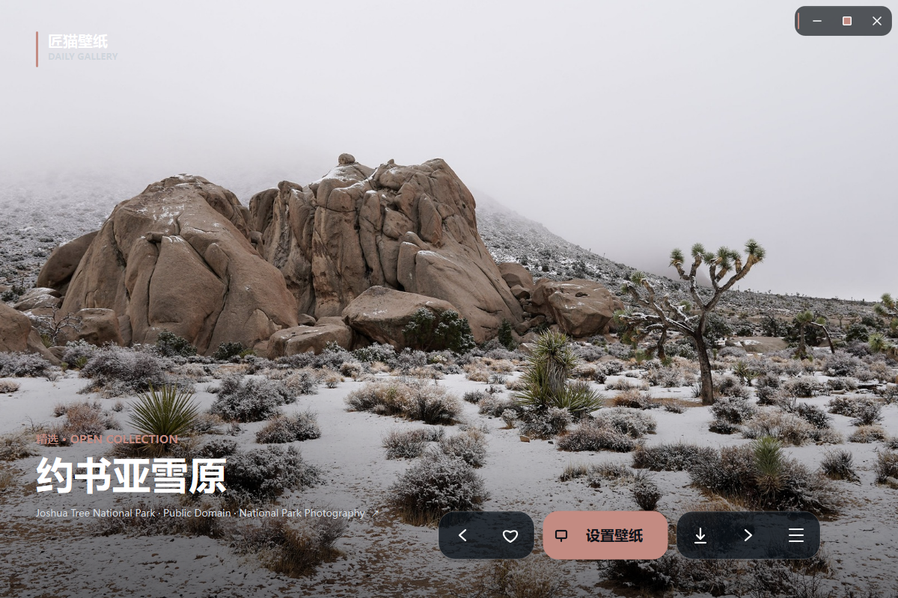
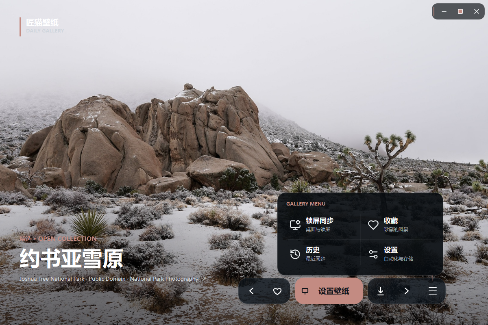
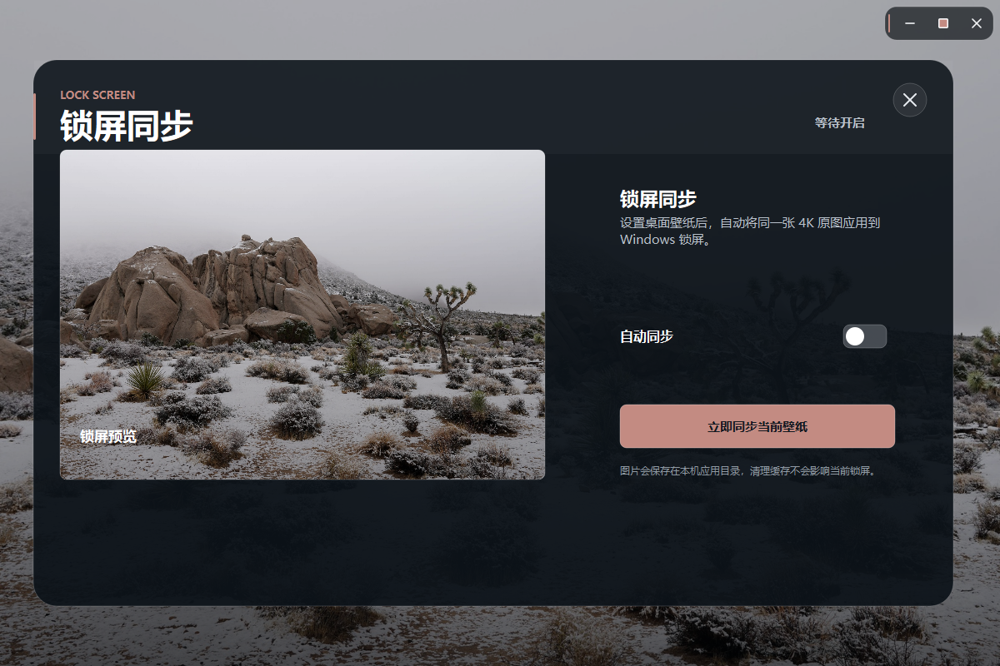
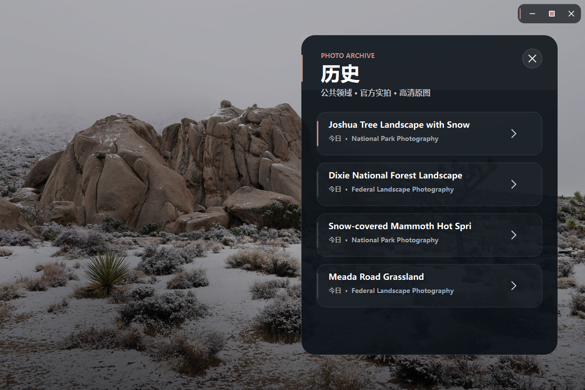
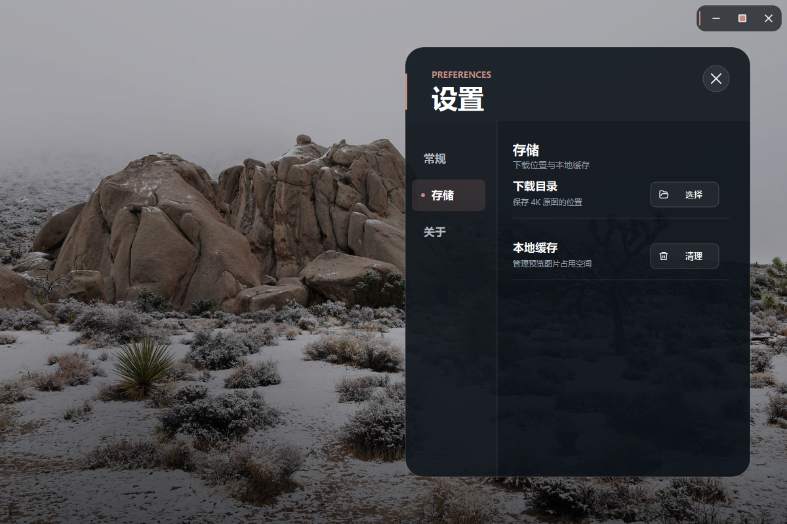
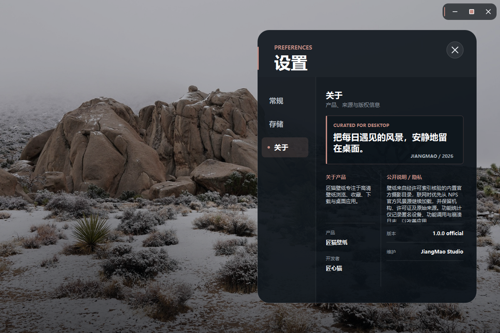

<div align="center">

# 匠猫壁纸

**一款专注 Windows 桌面体验的 PySide6 高清壁纸应用。**

[](#)
[](#)
[](#)
[](#-测试)
[](LICENSE)

<br>



</div>

## 📷 产品预览

<table>
  <tr>
    <td></td>
    <td></td>
  </tr>
  <tr>
    <td></td>
    <td></td>
  </tr>
  <tr>
    <td></td>
    <td></td>
  </tr>
</table>

## ✨ 功能

- 沉浸式高清壁纸浏览、收藏、历史与顺滑切换
- 一键下载、设置 Windows 桌面壁纸及锁屏同步
- 自动切换、开机启动和本地缓存管理
- Windows 任务栏透明与磨砂效果
- 单文件便携 EXE，无安装流程
- 默认完全离线，不包含统计、公告、更新或第三方 API

## 🧭 数据与隐私

公开版本只使用 `jiangmao_wallpaper/ui/assets/starter/` 中的内置壁纸。项目不创建遥测实例，不上传功能事件、崩溃信息或设备数据，也不查询远程公告和更新。

内置壁纸清单保留作者、来源页和许可证字段，用于版权核验；这些链接不是运行时 API。新增或替换图片时，请确认原许可允许再分发，并保留归属信息。

## 📦 项目结构

```text
jiangmaobizhi/
├── jiangmao_wallpaper/          # 应用、业务服务与 UI
│   ├── providers.py        # 离线 Provider 与扩展链
│   └── ui/assets/          # 图标、菜单资源和内置壁纸
├── examples/               # 自定义 API Provider 模板
├── docs/
│   ├── API_PROVIDERS.md    # API 接入与轮换规范
│   └── BUILDING.md         # 开发、测试与打包
├── tests/                  # 全离线测试
├── JiangMaoWallpaper.spec          # PyInstaller 配置
└── main.py                 # 程序入口
```

## 🚀 快速开始

```powershell
git clone https://github.com/JiangXinMao/jiangmaobizhi.git
cd jiangmaobizhi
python -m venv .venv
.\.venv\Scripts\Activate.ps1
python -m pip install -r requirements.txt
python main.py
```

完整环境与 EXE 构建步骤见 [docs/BUILDING.md](docs/BUILDING.md)。

## 🔌 接入自己的 API

应用通过 `WallpaperProvider` 协议接入数据源，`ProviderChain` 按注册顺序自动切换。公开代码不预置任何真实 Endpoint 或 Key。

1. 参考 `examples/custom_provider.py` 实现字段映射。
2. 从环境变量读取密钥。
3. 在 `jiangmao_wallpaper/providers.py` 的 `default_provider_chain()` 注册并排列优先级。
4. 保留 `BundledWallpaperProvider` 作为离线兜底。

详细说明、轮换示例和合规检查见 [docs/API_PROVIDERS.md](docs/API_PROVIDERS.md)。

## 🧪 测试

```powershell
$env:QT_QPA_PLATFORM='offscreen'
python -m pip install -r requirements-dev.txt
python -m pytest -q
```

当前测试全部离线运行，不调用真实服务。

## 🤝 贡献

欢迎提交 Issue 和 Pull Request。涉及新图片源时，请同时提交 Provider 测试、接口条款链接、许可证筛选策略、署名方式及限流方案。不得提交真实密钥、私有 SDK、用户数据或无明确再分发许可的图片。

## 📄 许可证

本项目采用 [Apache License 2.0](LICENSE) 开源。

任何人都可以使用、复制、修改、分发及商业使用本项目，但必须遵守许可证要求：保留许可证、版权和归属声明，并在修改过的文件中注明变更。项目版权声明见 [NOTICE](NOTICE)。

Copyright 2026 JiangXinMao

---

<div align="center">

**Built for a quieter Windows desktop.**

[Report Issues](https://github.com/JiangXinMao/jiangmaobizhi/issues) · [API Guide](docs/API_PROVIDERS.md) · [Build Guide](docs/BUILDING.md)

</div>
